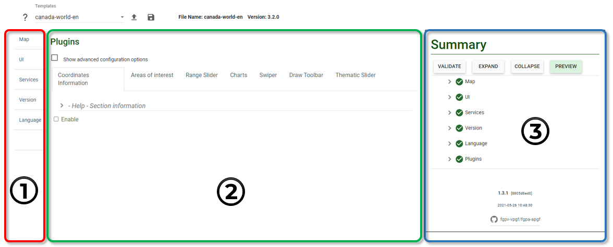
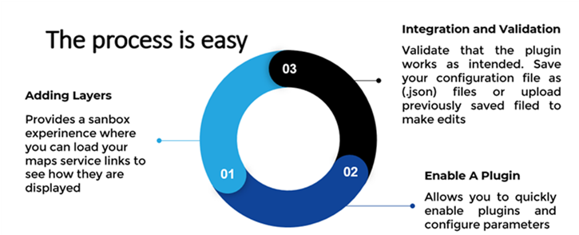
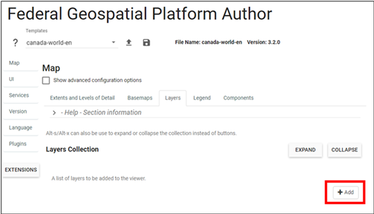
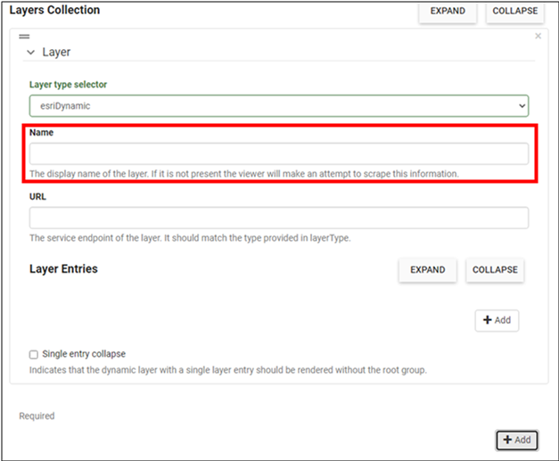
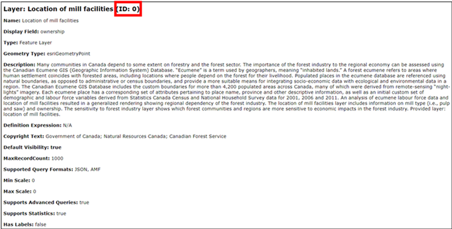
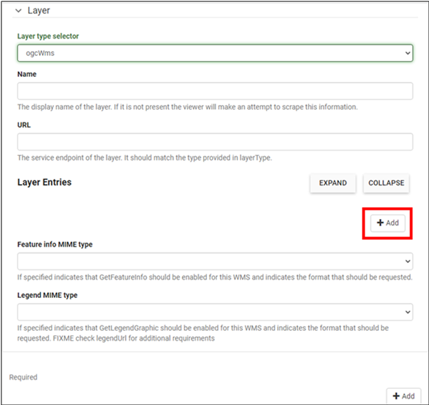
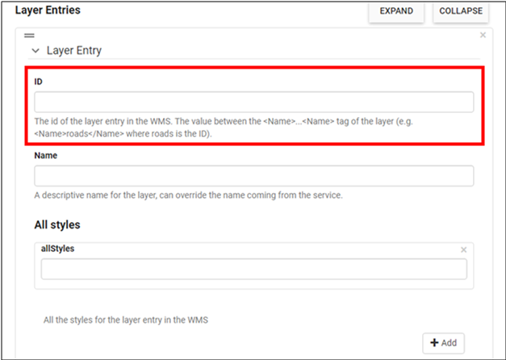
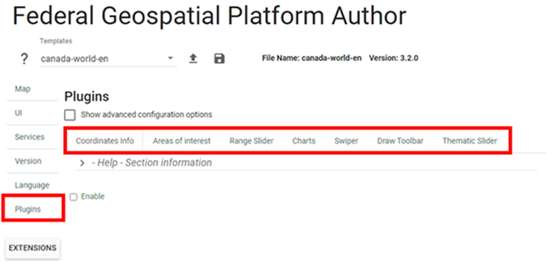
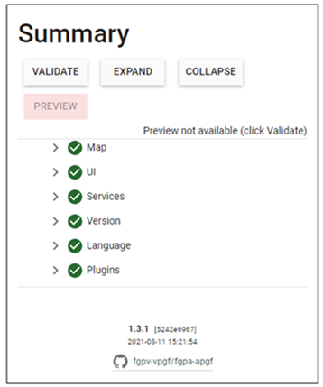
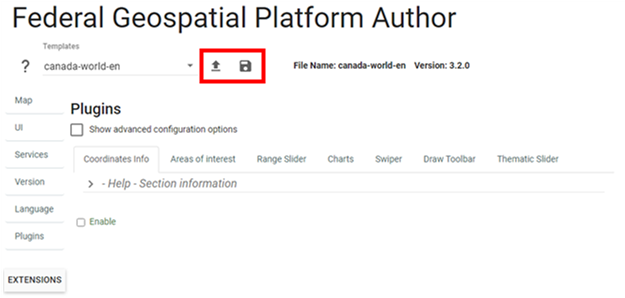

# FGP Authoring Tool – Interface to FGP Plugins:
## What is the Authoring Tool?

The FGP Authoring Tool is a Web application that provides you with a friendly environment where you can easily enable a plugin, access the Web map service(s) as input to the plugin, configure the plugin seamlessly, and test and validate the configuration file.    
The Authoring Tool’s interface (Figure 4) can be broken up into three areas:
(1) Navigation pane (left side) allows the user to move between the different elements of the web application. 
(2) Configuration panel (middle): parameters for configuring web services. 
(3) Summary pane (right side):  This section allows the user to validate and preview the configured maps. The summary provides a way to indicate where errors occurred in the configuration setup.

Visit the [FGP Authoring Tool](https://viewer-visualiseur.services.geo.ca/fgpv-vpgf/author-auteur/index-en.html)

<figure>
  
  <figcaption>Figure 4: Authoring Tool Interface</figcaption>
</figure>

## Using the Authoring Tool to Configure a Plugin– A Use Case

The workflow starts with Adding A New Layer (or called Testing), followed by Enable A plugin, and completed by Validation and Integration (Figure 5).

<figure>
  
  <figcaption>Figure 5: Authoring Tool - Workflow</figcaption>
</figure>

### Adding a new layer

**<u>Step 1.</u>** From the <emp>Navigation</emp> pane, select the <emp>Map tab</emp>.

**<u>Step 2.</u>** Select the <emp>“Layers”</emp> tab from the options and click on the <emp>Add</emp> button to be able to add layers to the viewer (Figure 6).

<figure>
  
  <figcaption>Figure 6: Authoring Tool - Add New Layer</figcaption>
</figure>

**<u>Step 3.</u>** Select the <emp>type</emp> of map service that will be loaded. There are several options to choose from. Identify the best option that matches the type of map service that relates to what is published.

**<u>Step 4.</u>** Provide a <emp>name</emp> that will be displayed for the layer. If it is not present the viewer will attempt to scrape this information from the map service (Figure 7).

<figure>
  
  <figcaption>Figure 7: Authoring Tool - Configure Layer</figcaption>
</figure>

**<u>Step 5.</u>** Provide the <emp>URL</emp> of the map service. This is the service endpoint of the layer. It should match the type provided in the layer type.

Extra Steps: Some layer types require extra inputs to be completed before they will load.

<emp>Esri Dynamic</emp>

**<u>Step 5a.</u>** Click on the <emp>Add</emp> button under <emp>Layer Entries</emp>. This will open another section where the <emp>“Index”</emp> of the layer can be entered. The <emp>"Index”</emp> of the layer references the ID of the map service. Take for example this layer (Location of mill facilities), the ID of this layer is <emp>0</emp> which corresponds to the <emp>Index</emp> (Figure 8).

<figure>
  
  <figcaption>Figure 8: Example Map Service End Point – Location of mill facilities</figcaption>
</figure>

**<u>Step 5b.</u>** Optionally, a descriptive name for the layer under the <emp>Name</emp> field can be entered. However, doing so will override the name coming from the service.

<emp>OGC WMS</emp>

**<u>Step 5a.</u>** Click on the Add button under Layer Entries (Figure 9). This will open another section where the <emp>“ID”</emp> of the later entry in the WMS can be inputted (Figure 10). This is the value between the <emp><Name> …. </Name></emp> tag of the layer. Optionally, a descriptive name for the layer under the <emp>Name</emp> field can be entered. However, doing so will override the name coming from the service.

<figure>
  
  <figcaption>Figure 9: Authoring Tool - Add Layer (OGC WMS)</figcaption>
</figure>

<figure>
  
  <figcaption>Figure 10: Authoring Tool - Add Layer (OGC WMS) cont.</figcaption>
</figure>

**<u>Step 5b.</u>** <emp>OGC WMS</emp> also includes options to include <emp>“Feature info MIME type”</emp> and <emp>“Legend MIME type”</emp> (Figure 9). The <emp>“Feature info MIME type”</emp> indicates the format that should be requested from the <emp>WMS</emp> map service. The <emp>“Legend MIME type”</emp> indicates the format of the Legend that should be requested from the <emp>WMS</emp> map service.

**<u>Step 6.</u>** Navigate to the <emp>“Validate”</emp> and <emp>“Preview”</emp> button on the Summary pane. Pressing on the <emp>Validate</emp> button will ensure that all parameters are checked and meet requirements for reviewing.

!!! Tip 
    As many layers can be added as required.

!!! Note
    if any issues are identified, the section with the error will be automatically highlighted in the Summary Pane.

### Enable Plugins

Now that the layers are loaded and verified to be working properly.

Navigate to the <emp>Plugins</emp> tab. This is found at the bottom of the Navigation (left) pane (Figure 11).

The <emp>Plugins</emp> tab presents all the available plugins for time series data as well as other optional plugins. Each plugin has specific parameters which are required to be configured to successfully work with the data (see next section for the details).

<figure>
  
  <figcaption>Figure 11: Authoring Tool - Enable plugins</figcaption>
</figure>

### Validation and Integration

Final step: validate and preview to make sure everything works as it should (Figure 12).

<figure>
  
  <figcaption>Figure 12: Authoring Tool - Summary pane</figcaption>
</figure>

After completing the workflow and validation is successful, a .json configuration file can be generated and saved (Figure 13). This configuration file can be later uploaded back to the FGP Authoring tool if changes are required.

<figure>
  
  <figcaption>Figure 13: Authoring Tool - Save and Upload</figcaption>
</figure>

### Author and Support

The Author and maintainer for FGP plugins and the Authoring tool is Johann Levesque, FGP, NRCan. To report an issue, please create an issue from the GitHub repository. Add the plugin label and any other applicable information. [GitHub Repository](https://github.com/fgpv-vpgf/contributed-plugins/issues){target=\_blank}.

