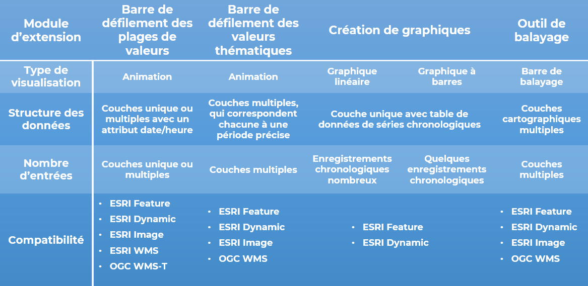

# Choosing Plugins for your needs

Four plugins are introduced here for time series visualization: Range Slider, Thematic Slider, Charting Tools, and Swiper. They are for different purposes:

- [x] Range Slider and Thematic Slider are for the creation of map animations;
- [x] Charting Tools are for visualization of time series data available on specific sites on a map; and
- [x] Swiper is for the detection of changes over a period of time. 

Multiple factors determine the choice of a plugin for your needs:  

- [x] The structure of data is the key determinant to plugin choice.

    - If your time series data in your dataset is presented on fixed locations (such as monitoring sites or watersheds) utilizing linked tables, the charting tool is your choice; 

    - Otherwise, time series animation may be the way to go, using either Range Slider or Thematic Slider. Deciding between them comes down to the data structure of the dataset:

        - If your data a single layer present with a valid date/time field, the Range Slider is the best option; and
        - If the data is composed of multiple layers each corresponding to a valid time, then the Thematic Slider would be the better choice.

- [x] The number of time points in the time series is another factor to consider 

    - When using the map-based Charting Tool
        - Choose Line Chart if the time series data includes values of many time points
        - Otherwise, Bar Chart would be a better choice;
    - If there are three or more time series layers, create an animation using Range Slider or Thematic Slider (see above for choice);
    - If there are only two layers representing two points/periods of time, using Swiper. 

- [x] The compatibility of plugins with the source map services determines the feasibility of a plugin for your data.

This information is summarized in Table 1 for reference

<figure>
  
  <figcaption>Table 1: Choosing the plugins for your needs</figcaption>
</figure>