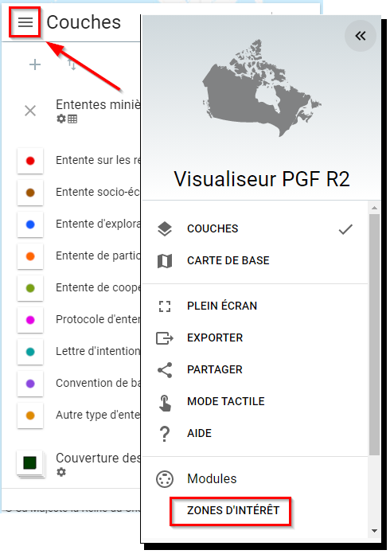

# Area of Interest Plugin
## What is the Area of Interest Plugin?

The Area of Interest plugin allows specific geographic extents on a map to be easily displayed. Using the Area of Interest plugin, simply click on the preprepared extent and zoom to the specified area. By bringing the area into focus, the user can learn more about that area. 

The world is full of information, which means highlighting necessary information/locations on the map without distracting the user can be a huge task. Utilizing the Area of Interest plugin, the results are a cleaner look that makes it easier to see helpful and actionable information. The highest places with the highest concentration of value to the user are brought forth to the user as they explore the map (Figure 48).

<figure>
  
  <figcaption>Figure 48: Map Showing Land Cover for Agricultural Regions for Canada and Indigenous Mining Agreements</figcaption>
</figure>

**Feature Highlight**

- Directly points users to the extent indicated.
- Ability to customize the thumbnail of each Area of Interest.

The Area of Interest plugin can be accessed using the <emp>Menu tab</emp> to the left of the Layers information box.

<figure>
  
  <figcaption>Figure 49: Activate Area of Interest plugin</figcaption>
</figure>

After clicking on the <emp>Menu bar</emp> (Figure 49), scroll to the bottom and look under the <emp>plugins</emp> section. Simply click on the <emp>Area of Interest</emp> plugin to enable it.

## Configuring the Area of Interest Plugin

**<u>Step 1. Enable Area of Interest</u>**

Navigate to the <emp>Plugins</emp> section in the FGP Authoring Tool. Under the <emp>Area of Interest</emp>, click on <emp>Enable</emp> (Figure 50).

<figure>
  
  <figcaption>Figure 50: Area of Interest - Configure Parameters</figcaption>
</figure>

**<u>Step 2. Provide Areas of Interest</u>**

Provide a subsequent <emp>English Title</emp> and <emp>French Title</emp> that describes your dataset. Click on <emp>Set Area</emp> to set the Area of interest. Zoom and pan to the extent then close the window. If applicable, provide a thumbnail URL pointing to an image to be displayed.

!!! Tip
    Holding down the shift key while left-clicking on the mouse draws a square box that will quickly zoom to any area of interest.

!!! Note
    By clicking on the Add button (Figure 50), you can add as many Areas of Interest as required.

## Preview plugin

<figure>
  <iframe id="iframe1" allowfullscreen=true importance = high data-src="https://negice.github.io/usecase/aoi/samples/aoi-index1.html"></iframe>
</figure>