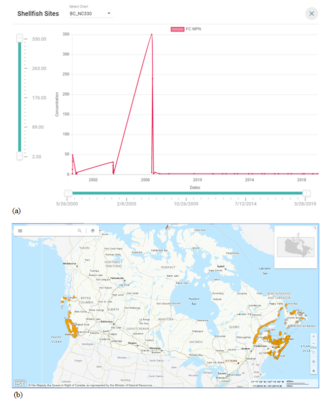
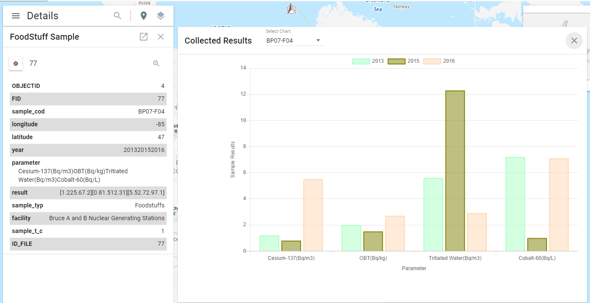
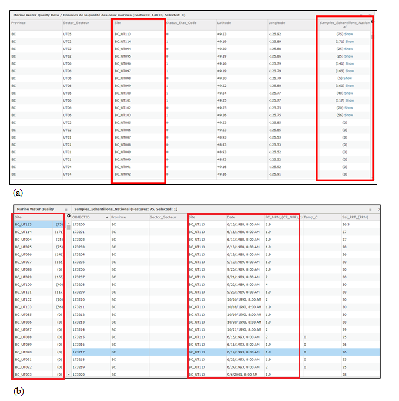
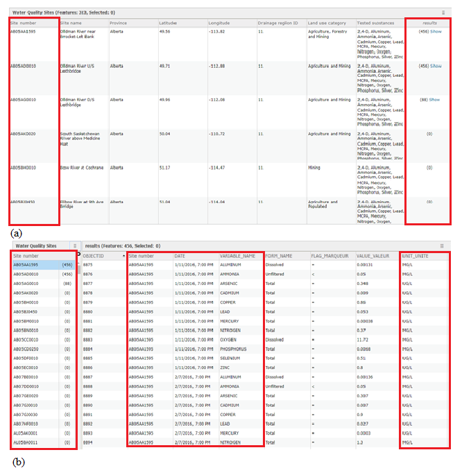
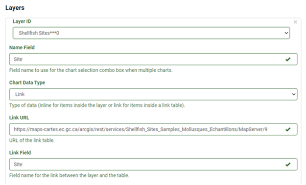
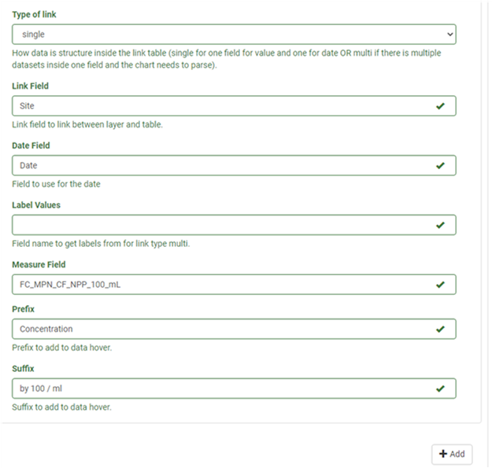
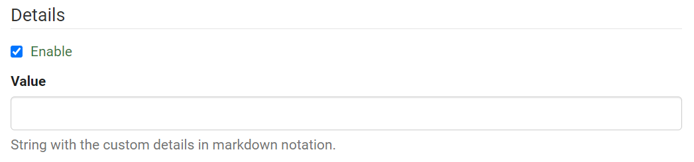

# Charting Tools
## What is the Charting Tool?

The Chart plugin provides a map-based charting tool that enables the visualization of one of the most common time series data in a spatial context, i.e. time series monitoring data available on specific sites such as weather stations, or in fixed regions such as watersheds. With the distribution of the sites or regions represented as a map service, the Charting Tool enables the creation of a Line Chart or Bar Chart for the time series data by sites/regions. This time series dataset may contain more than one variable, which can be charted accordingly by both the Line and Bar Chart.

<figure>
  
  <figcaption>Figure 32: a) Line Chart showing the concentration of Fecal Coliforms per 100 ml samples over time for a shellfish site selected from the shellfish monitoring map; b) map showing shellfish monitoring sites.</figcaption>
</figure>

Figure 32 shows an example of map-based charts for time series visualization. The Line Chart shows data collected for one of the shellfish sites under monitoring across Canada. By clicking a monitoring site on the Shellfish Monitoring Map below, the user will see the Chart pop up.  The sliders for the X and Y Axis allow the user to filter results to show specific value ranges or time ranges respectively. More information on the data source can be found from the metadata.

<figure>
  
  <figcaption>Figure 33: a) Bar Chart showing the sample results in 2013, 2015 and 2016 for four parameters on one of the Independent Environmental Monitoring Stations in Canada by Canadian Nuclear Safety Commission; b) Map representing the distribution of the monitor stations.</figcaption>
</figure>

An example of a Bar chart is provided in Figure 33 representing data collected from one of the Independent Environmental Monitoring Stations. The data verify that the public and environment around CNSC-regulated nuclear facilities are not adversely affected by releases to the environment. More information on the data source can be found from the metadata.

In addition, the Charting plugin supports Pie Chart, which may be used to visualize non-time series data.

## When to use it?

### Line Chart

If you have a map service created to represent monitoring sites or fixed regions and if time series data is available over each site or region, the Line Chart is the preferred choice for visualizing the time series data for several reasons:

- The advantage of showing trends of change, which is often of central interest for monitoring;
- The ability to show a long series of observations;
- The capacity to include a good number of lines each corresponding to a variable; and
- The capability to show the trend of a variable in comparison with that of other variables.

<figure>
  
  <figcaption>Figure 34: Line Chart showing concentration of Fecal Coliforms per 100 ml  on a monitoring site; underneath the Chart is the map showing shellfish monitoring sites across Canada</figcaption>
</figure>

In this example Figure 34, the Line Chart was used to visualize the time series data from data collected from Shellfish Sites. The data is dynamically represented in a rendered line chart where the user can use the onscreen slider to dynamically manipulate the data. The Line Chart supports a slider to filter results by the date or by the results.

### Bar Chart

The Bar Chart is preferred to Line Chart when the site/region-based time series data has sparse observations, for example, three observations or even less. A Bar Chart in this case can be used with each observation represented by a bar, and successive bars to show the changes over time.

<figure>
  
  <figcaption>Figure 35: Bar Chart for a monitoring station, popped up when the user clicks on a monitoring station of the Independent Environmental Monitoring Stations map (underneath the Bar Chart).</figcaption>
</figure>

In this use case (Figure 35), the map-based bar chart tool was used to visualize the Independent Environmental Monitoring Station time series data. The collected parameters was used along the x-axis while the y-axis represents the collected sample results. The year of data collection was used as the variables (i.e. 2013, 2015, 2016). Bar Chart was preferred to Line Chart for visualization of this dataset due to the limited timestamps available.  More information on this dataset can be found in the metadata.

## How to use it - A use case

Using the Shellfish Monitoring data for a use case, we illustrate how to use the Charting plugin to create map-based Line Charts. This dataset provides marine bacteriological water quality observations for bivalve shellfish harvest areas in Canada (British Columbia, New Brunswick, Newfoundland, Nova Scotia, Prince Edward Island and Quebec).

### Preparing the Data

**Linked Tables**

Linked Tables refers to using two or more tables that share the same field. This data structure establishes a relationship between the datasets through which a single table containing all the parameters and values is related to the reference data. In the use case example, Shellfish Water Classification Program, the data structure of this dataset reveals that relationship tables are used. The layer <emp>“Marine Water Quality Data”</emp> is linked to the <emp>“Samples_Echantillons_National”</emp> table by the “Site” field (Figure 36). Starting from the layer, the Charting plugin is automatically directed to access this related table and pulls the required time series data to generate the appropriate chart.

<figure>
  
  <figcaption>Figure 36: Shellfish Water Classification Program map service endpoint showing layers, linked tables and relationship tables data structure</figcaption>
</figure>

### Data Structure

Data structure here refers to the organization of the data file for use by the Chart plugin. It takes into consideration linked tables and efficient access and modifications of data.  The Charting plugin supports three options of data structure.  

#### Option 1
Following the same structure as the use case example (Figure 36), the data can be organized using linked tables. The map service has the layer <emp>“Marine Water Quality Data”</emp> is linked to the <emp>“Samples_Echantillons_National”</emp> table by the <emp>“Site”</emp> field (Figure 37). It can be seen that the <emp>“Site”</emp> name serves as the unique identifier linking the layer and the table, and the bracketed numbers in Figure 37 (b) refer to the number of observations on each monitoring site. The <emp>“Date”</emp> field contains the date of the observations and the <emp>“FC_MPN_CF_NPP_100_mL”</emp> field has the recorded values.

<figure>
  
  <figcaption>Figure 37: Data structure for Option 1 – a) Layer table with references to linked table highlighted, b) Linked table with reference to layer table and time series data highlighted</figcaption>
</figure>

#### Option 2
Where a large number of parameters are observed on a site, you may use Option 2 to organize your data for use by the Charting plugin. Similar to option 1, the data is mapped as a layer and linked to a table that holds the records of time series observations (Figure 38 (a)). The difference from the previous use case is that there is a large number of parameters being observed, as shown in Tested substances of Figure 38 (b). In this case, the time series data can be organized in a manner to avoid making the linked table too wide.  

As shown in Figure 38 (b), there is now one field that lists all the parameters <emp>[“VARIABLE_NAME”]</emp>, a field that lists the corresponding data value <emp>[VALUE_VALEUR]</emp>, a field that lists the corresponding dates <emp>[DATE]</emp> and likewise the units of the values <emp>[UNIT_UNITE]</emp>.  The table starts with listing all the parameters with dates and monitoring sites repeating, then all the dates of observations with monitoring sites repeating, and finally all the monitoring sites.

<figure>
  
  <figcaption>Figure 38: Data Structure Option 2 – a) Layer table with references to linked table highlighted, b) Linked table with reference to layer table and time series data highlighted</figcaption>
</figure>

#### Option 3
Organizing the time series data where fields are created by concatenating the data into one field as inline text. This structure requires that the data be formatted in a specific way. Each field to be charted is required to have the data listed and separated using parenthesis and commas. (Figure 39). If your data is not already in this format, this data structure will require a detailed workflow to get the data in this format. 

This method is not recommended because it requires a structured workflow to concatenate the data in a new field to meet the requirements. Each parameter observed would require a new field to be created. However, if there are constraints in the data which require and suits this data structure it is available to be used for charting.

<figure>
  
  <figcaption>Figure 39: Data structure for Option 3</figcaption>
</figure>

## Configuring the Line Chart

Before you begin, Ensure that all Layers to be used should be configured in Authoring tool under the <emp>Map Tab</emp>. [(See Section: Using the Authoring Tool to Configure a Plugin – Adding a new layer)](/authortool/#adding-a-new-layer)

**<u>Step 1. Enable Charting plugin.</u>**

Navigate to the <emp>Plugins</emp> section in the FGP Authoring Tool.
Under the <emp>Charts tab</emp>, click on <emp>Enable</emp>.

<figure>
  
  <figcaption>Figure 40: Line Chart - Enable</figcaption>
</figure>

**<u>Step 2. Define Axis Labels</u>**

1. Choose the <emp>“Type”</emp> and set the Title for the X-Axis.
Under the <emp>“Type”</emp>, choose the option that best suits the intended use case.

    1. <emp>Date</emp> – If set, the expected format of the date data would be in the form of Year-Month-Day or follow a similar convention. (e.g., YYYY-MM-DD; DD-MM-YYYY)

    2. <emp>Linear</emp> – If set, the expected format of the date data would be linear (e.g., YYYY)

In the use case example, the <emp>“Type”</emp> is set to Date (Figure 41).

2. Set the <emp>“Type”</emp> and Title for the Y-Axis
Under the <emp>“Type”</emp> the only option available is Linear (Figure 41).

<figure>
  
  <figcaption>Figure 41: Line Chart - Axis Labels</figcaption>
</figure>

**<>Step 3. Select Layer</u>**

1. <emp>Layer ID</emp> - Under the <emp>Layer Id</emp>, select the layer with which the plugin will work. The <emp>layer Id</emp> is automatically generated when adding a map service to the Authoring Tool. Each layer will have a unique Id generated. Ensure that the layer to be used is being selected. In the use case, this layer is <emp>“Shellfish Sites”</emp> (Figure 42).

2.	<emp>Name Field</emp> – Choose a corresponding field to be used to identify with the generated Charting visualization. In the use case, the <emp>“Site”</emp> field was used to identify what site data is being displayed.

3. <emp>Chart Data Type</emp> – Choose the best option that relates to the data structure used for the dataset. In the use case, Link was used because the data structure uses Linked Tables.

4. <emp>Link URL</emp> – If the link is set as the <emp>Chart Data Type</emp>, provide the URL link of the linked table. This can be found on the map service page. In the use case, the URL link for the Linked table was provided.

5. <emp>Link Field</emp> – If Link is set as the <emp>Chart Data Type</emp>, provide the common field used for the relationship between the tables. In the use case, the <emp>“Site”</emp> field was the relationship field

<figure>
  
  <figcaption>Figure 42: Line Chart – Layers</figcaption>
</figure>

**<u>Step 4. Configure Data Parameters (Figure 43)</u>**

1. <emp>Type of Link</emp> – Choose the type that reflects how the data is structured.
    1. <emp>Single</emp> – Choose this If the data structure of your data follows Option 1 (see Preparing data), i.e.  the names of parameters being observed are shown only at the top of the linked table. This is the case for the Shellfish use case.  See Preparing the data - Option 1 for more details. 
    2. <emp>Multi</emp> – Select this If Option 2 applies to your data, i.e., there is one field of the linked table having parameter names as the values. one field with the date and one field with the results. See Preparing the data – Option 2.

2. <emp>Link Field</emp> – Provide the name of the field that links the layer and the linked table

3. <emp>Date Field</emp> – Provide the field name that corresponds to the <emp>“Date”</emp> field of the linked table. In the use case, this field name was <emp>“Date”</emp>.

4. <emp>Label Values</emp> – If the <emp>“Type of Link”</emp> was set to multi, provide the field name that corresponds to the units of measure. Otherwise, this remains empty. In the use case, this was left empty because the <emp>“Type of Link”</emp> was set to <emp>“Single”</emp>

5. <emp>Measure Field</emp> – Provide the field name that corresponds to the data to be displayed by the Chart. In the use case, the field name used was <emp>”FC_MPN_CF_NPP_100_mL”</emp>. Note that the exact field name must be used. 

6. <emp>Prefix</emp> – If required, provide a prefix to be displayed when the user hovers over the data. In this use case, when the user hovers the mouse over the chart data, <emp>“Concentration”</emp> will be used as the prefix before displaying the value.

7. <emp>Suffix</emp> - If required, provide a suffix to be displayed when the user hovers over the data. In this use case, when the user hovers the mouse over the chart data, <emp>“by 100 / ml”</emp> will be used as the suffix after displaying the value.

**Optional**, if more data Fields are required to be displayed, click on the <emp>Add</emp> button (Figure 43) to add a new data parameter and repeat the steps to configure.

<figure>
  
  <figcaption>Figure 43: Line Chart – Data</figcaption>
</figure>

**<u>Step 5. Details Option</u>**

Optionally (Figure 44), under the <emp>“Details”</emp> parameter, the details panel can be customized. Using the markdown notation, it is possible to provide customized additional information in the details panel. An example can be found here

<figure>
  
  <figcaption>Figure 44: Line Chart - Custom Details Parameter</figcaption>
</figure>

## Definition of parameters

Listed in the following table are the definitions of all the parameters available when using the FGP Authoring Tool to configure the Charting plugin.

<table>
  <tr>
    <th></th>
    <th>Parameters</th>
    <th>Description</th>
  </tr>
 <tr>
    <th rowspan="2">General</th>
    <td id=parameters>Type</td>
    <td>Determines the type of chart to be created. This includes a pie chart, bar chart or line chart</td>
  </tr>
  <tr>
    <td id=parameters>Title</td>
    <td>Determines the chart title to be displayed</td>
  </tr>
   <tr>
    <th rowspan="1">Options</th>
    <td id=parameters>Datasets Colors</td>
    <td>An option to include hexadecimal color values to use to display the chart</td>
  </tr>
   <tr>
    <th rowspan="2">Label Axis</th>
    <td id=parameters>Type</td>
    <td>Determines the type of label to be used. The label names can be retrieved from a field from the layer (Linear or Date for line chart) or configuration. (Linear or Date) for the line chart.</td>
  </tr>
  <tr>
    <td id=parameters>Title</td>
    <td>Determines the title name to be used for the different axis</td>
  </tr>
  <tr>
    <th rowspan="6">Layers</th>
    <td id=parameters>Id</td>
    <td>Determines the layer id as defined in the layer section.</td>
  </tr>
  <tr>
    <td id=parameters>Name Field</td>
    <td>Determines the field used to identify the data being displayed by the chart.</td>
  </tr>
    <tr>
    <td id=parameters>Chart Data Type</td>
    <td>Determines the type of data to be expected by the Charting plugin (Inline, Link).
    <ol type="i">
     <li id=tablelist>Inline – Data structure using Inline Text. See Preparing data for more information</li>
     <li id=tablelist>Link – Data is structured using Linked Tables. See Preparing data for more information</li>
    </ol>
</td>
  </tr>
    <tr>
    <td id=parameters>Link URL</td>
    <td>Determines the URL for the linked Table. This is only required if the “Chart Data Type” is set to “Link”</td>
  </tr>
    <tr>
    <td id=parameters>Link Field</td>
    <td>Determines the field name that links the layer to the data table. This is only required if the “Chart Data Type” is set to “Link”</td>
  </tr>
      <tr>
    <td id=parameters>Data</td>
    <td>Determines the different parameters for the layer to use to create the chart
     <ol type="i">
          <li id=tablelist>Type of Link – Determines the type of data structure to expect. This is based on how the data is structured inside the link table
          <ol type="a">
                    <li id=tablelist>Single – For option 1. See Preparing your data for more information
                    <li id=tablelist>Multi – For option 2. See Preparing your data for more information
          </ol>
          </li>
          <li id=tablelist>Link Field – Determines the field used to link the relationship between layer and table.</li>
          <li id=tablelist>Date Field – Determines the field used for time series dates.</li>
          <li id=tablelist>Label Values – Determines the field corresponding to the unit labels for the parameters if available..</li>
          <li id=tablelist>Measure Field – Determines the field corresponding to the time series collected results to create the chart. Note the field name must be used and not the field alias.</li>
          <li id=tablelist>Prefix – Determines the prefix to be added to the data hover</li>
          <li id=tablelist>Suffix – Determines the suffix to be added to the data hover</li>
        </ol>
  </tr>
     <tr>
    <th rowspan="1"></th>
    <td id=parameters>Details</td>
    <td>Specifies if the details panel should be customized. Custom details can be included using the markdown notation.</td>
  </tr>
</table>

