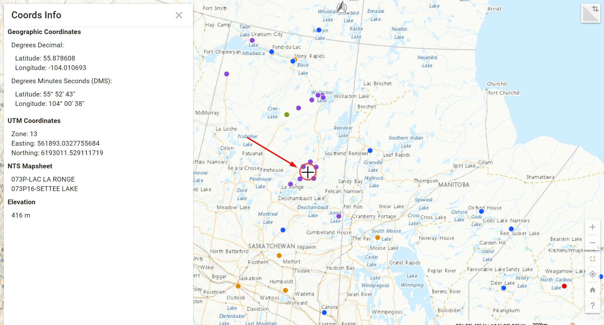

# Coordinates Info Plugin
## What is the Coordinates Info Plugin?

The coordinates Info plugin provides the geographic coordinates of any point on the map (Figure 51).

<figure>
  
  <figcaption>Figure 51: Map Showing Indigenous Mining Agreements (Expired)</figcaption>
</figure>

**Feature Highlight**

- Geographic Coordinates
- UTM Coordinates
- National Topographic System Index Maps (NTS)
- Provides elevation at any point.

The Coordinates Info plugin can be accessed using the <emp>Menu tab</emp> to the left of the Layers information box. 

<figure>
  
  <figcaption>Figure 52: Activate Coordinates Info plugin</figcaption>
</figure>

After clicking on the <emp>Menu bar</emp> (Figure 52), scroll to the bottom and look under the <emp>plugins</emp> section. Simply click on the <emp>Coordinates Info</emp> plugin to enable it.

!!! Tip
 	This is extremely useful when there is a need to know a spot elevation or NTS reference.

## Configuring the Coordinates Info Plugin

**<u>Step 1. Enable Coordinates Info plugin</u>**

Navigate to the <emp>Plugins</emp> section in the FGP Authoring Tool. Under the <emp>Coordinated Info tab</emp>, click on <emp>Enable</emp> (Figure 53).

<figure>
  
  <figcaption>Figure 53: Coordinates Info - Enable</figcaption>
</figure>

## Preview plugin

<figure>
  <iframe id="iframe1" allowfullscreen=true importance = high data-src="https://negice.github.io/usecase/coord/samples/coord-index.html"></iframe>
</figure>