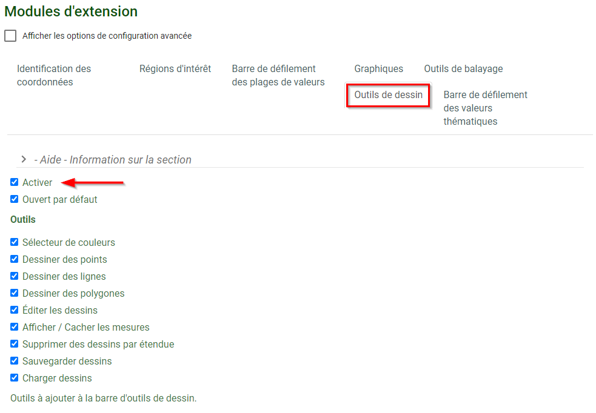

# Draw Toolbar Plugin
## What is the Draw Toolbar Plugin?

The Draw Toolbar encourages users to interact directly with the map. Functionally, it gives the ability to create new geometries by drawing them on the map. The Drawing toolbar contains a collection of icon buttons that allows the user to draw shapes and images in the document (Figure 54).

<figure>
  
  <figcaption>Figure 54: Map Showing Indigenous Mining Agreements (Expired)</figcaption>
</figure>

**Feature Highlight**

- Some of the features that the Draw Toolbar provides:
- Draw Points / Lines / Polygons
- Edit / Erase created features
- Save / Upload Drawing
- Includes distance to features such as lines, perimeter and area of polygons.

## Configuring the Draw Toolbar Plugin

**<u>Step 1. Enable Draw Toolbar</u>**

Navigate to the <emp>Plugins</emp> section in the FGP Authoring Tool. Under the <emp>Draw Toolbar tab</emp>, click on <emp>Enable</emp> (Figure 55).

<figure>
  
  <figcaption>Figure 55: Draw Toolbar - Enable</figcaption>
</figure>

**<u>Step 2. Enable Tools</u>**

Enable / Disable specific tools. By default, all the tools are enabled. Please note that any of the tools can be disabled to fit unique or specific use cases.

<table>
  <tr>
    <th>Button</th>
    <th>Name</th>
    <th>Function</th>
  </tr>
    <tr>
    <td></td>
    <td>Color Picker</td>
    <td>Allows you to select different colors</td>
  </tr>
  <tr>
    <td></td>
    <td>New Marker</td>
    <td>Draws a marker point</td>
  </tr>
    <tr>
    <td></td>
    <td>New Line</td>
    <td>Draws a line and includes the distance of the line</td>
  </tr>
    <tr>
    <td></td>
    <td>New Polygon</td>
    <td>Draws a polygon and includes the area and perimeter of the shape</td>
  </tr>
    <tr>
    <td></td>
    <td>Edit Vertices</td>
    <td>Allows you to edit the vertices of the selected line, polygon, or curve</td>
  </tr>
      <tr>
    <td></td>
    <td>Show/Hide Distances</td>
    <td>Allows you to toggle the visibility of the distance text</td>
  </tr>
    <tr>
    <td></td>
    <td>Erase</td>
    <td>Erase selected features</td>
  </tr>
    <tr>
    <td></td>
    <td>Save</td>
    <td>Saves graphics to file</td>
  </tr>
    <tr>
    <td></td>
    <td>Upload</td>
    <td>Uploads saved graphic file to the map</td>
  </tr>
</table>

## Preview plugin

<figure>
  <iframe id="iframe1" allowfullscreen=true importance = high data-src="https://jolevesq.github.io/contributed-plugins/draw/samples/draw-index.html"></iframe>
</figure>
