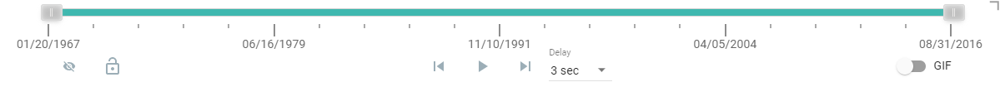
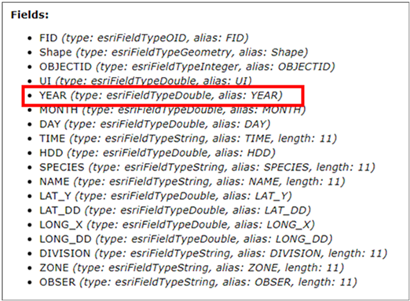
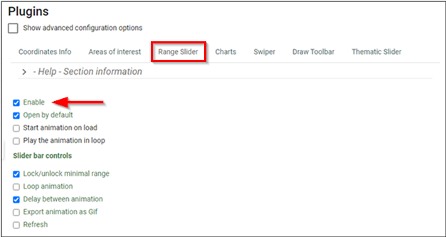
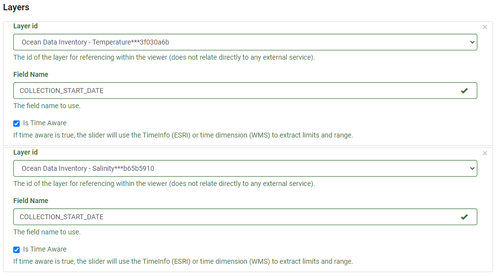

# Range Slider
## What is the Range Slider?

The Range/Time Slider offers a dynamic way to visualize time series data as well as non-time series data by “range”. It is also called Time Slider when used for time series visualization. The basic slider is a horizontal bar with anchors that can be moved to establish the range of the values to be used. To visualize data as a dynamic range, any layer that contains a date or numeric fields can be used. Once the range properties for the dataset are defined, an interactive, on-screen slider is rendered (Figure 14), which can be used to explore the data through a range/time in a customized manner. Using this plugin, the end-user can control the animation of the data with buttons to play and pause, go to the previous range/time, or go to the next range/time.

<figure>
  
  <figcaption>Figure 14: Range Slider Bar </figcaption>
</figure>

### Advantages of the Range/Time Slider

 The ability to provide Time-Series Animation or Range filtering of the data dynamically using only one layer; 

- The ability to export an animation as a GIF;
- Granular control over the time increment;
- Lock or unlock the anchors when in step or play mode; and 
- Interactively view filtered results.

Tip:
 Click on the top right corner to activate the compact mode

## When to use it?
### Getting the best out of the Range/Time Slider

The Range/Time Slider is best used to represent time series data that is embedded in a single layer.

Figure 15 shows the use of the Range Slider to visualize time series temperature data. The Range Slider uses the field “dStart” which corresponds to the start date of the data collected. Using the Range Slider, the entire dataset can be easily animated using a defined period. More information on the data source can be found from the metadata. By pressing the play button, the map will begin a time series animation based on the range set. This may be 1-year or 5-year increments. This is a useful ability to determine trends or patterns occurring within the dataset.

<figure>
   <iframe id="iframe1" allowfullscreen=true importance = high data-src="https://jolevesq.github.io/contributed-plugins/range-slider/samples/range-slider-index.html?sample=17"></iframe>
  <figcaption>Figure 15: Map Showing Maximum Temperature</figcaption>
</figure>

### Other uses for the Range Slider

The Range Slider can also be used in cases where there is a map service or layer with a numeric field present. 

Take, for example, Figure 16, the map layer for the dataset represents the general distribution of humpback whales in the Estuary and Gulf of St. Lawrence. The map service for this dataset has a few fields that can work with the Range/Time Slider plugin. In this example, the “Year” field was used (Figure 17), representing the time when the whale observation was made. More information on the data source can be found from the metadata.

<figure>
   <iframe id="iframe1" allowfullscreen=true importance = high data-src="https://jolevesq.github.io/contributed-plugins/range-slider/samples/range-slider-index.html?sample=14"></iframe>
  <figcaption>Figure 16: Map Showing Humpback Whale Observations</figcaption>
</figure>

<figure>
  
  <figcaption>Figure 17: Example of “Fields” from Map Service – Humpback Whales Observations</figcaption>
</figure>

## How to use it – A use case

Using the Ocean Data Inventory Temperature and Salinity datasets as a use case, below we demonstrate how we can configure a Range Slider (Figure 18).

<figure>
   <iframe id="iframe1" allowfullscreen=true importance = high data-src="https://jolevesq.github.io/contributed-plugins/range-slider/samples/range-slider-index.html?sample=15"></iframe>
  <figcaption>Figure 18: Map Showing Ocean Data Inventory Temperature and Salinity</figcaption>
</figure>

Using the left and right anchors of the Range Slider the data can be dynamically filtered to show specific time ranges. By clicking on the play button, the initial range set will be incremented by the specific duration. The user can set this duration at their discretion. At this point, the user can export a .gif animation that represents the time series data.

Tip:
 Use the anchors on the left and right to see the range of values to be displayed.

### Preparing the data

- To get started we need to ensure that the data is prepared in a format that will work well with the Range Slider plugin. In particular, you may ask:

- Is there a time field in the attribute table that makes this data an appropriate candidate for using Range Slider to create time series animation? As shown below, the attribute table does have a time field, i.e. COLLECTION_START_DATE.

- Do the values under the time field in the correct format? 

    - For time series animation, the range slider works best with a layer that has a time attribute in the attribute table. For example, this can be simply a year (1980) or date and time (1/1/1980 12:00:00).
    - For other use cases, once there is a numeric field present in the attribute table it will work with the Range Slider

- In the use case, the values are formatted using ESRI date format.

- Is the thematic layer served through this map service properly represented with respect to the color scheme, symbology, legend and projection? In the current case, the Temperature map, for example, shows appropriate designs for all the cartographic elements.

### Configuring the Range Slider

Before you begin, Ensure that all Layers to be used should be configured in Authoring tool under the <emp>Map Tab</emp>. [(See Section: Using the Authoring Tool to Configure a Plugin – Adding a new layer)](/authortool/#adding-a-new-layer)

**<u>Step 1. Enable Range Slider</u>**	
Navigate to the <emp>Plugins</emp> section in the FGP Authoring Tool. Under the <emp>Range Slider tab</emp>, click on <emp>Enable</emp> (Figure 19).

<figure>
  
  <figcaption>Figure 19: Range Slider - Enable</figcaption>
</figure>

Select from the following options (Figure 19) to enable them depending on the intended use case:

1. Start the animation on load – This will run the animation as soon as the map loads

2.	Play the animation in a loop – This will by default continue to loop through the animation.

3.	Under Slider bar controls, choose the options that best suit the intended use case:

    1.	Lock/unlock a minimal range
    2.	Loop playback
    3.	Export animation as GIF
    4.	Delay between animation
    5.	Refresh

**<u>Step 2. Define Parameters (Figure 22)</u>**

1. Choose the <emp>Slider Type</emp>

    Under the <emp>Slider Type</emp>, select one of the options, <emp>Number</emp>, <emp></emp> or <emp>WMS-T</emp>. This corresponds to the map service type that will be used with the plugin.

    !!! Note
        When using ESRI Image Service for the Layer Type, the Date Type option should be used

        When using OGC WMS, WMS-T Type is selected. 

        When using either DATE or WMS-T, the Range and Limit MUST BE represented in milliseconds

2. Choose the <emp>Range Type</emp>:

    <emp>Range Type refers to using one or two anchors for the slider.

      1. <emp>Single</emp>: Only displays one anchor, which is used to set single ranges (Figure 20).

        <figure>
          
          <figcaption>Figure 20: Range Slider - Single Anchor</figcaption>
        </figure>

      2.	<emp>Dual</emp>: Displays a left and right anchor. This allows for a range to be set using both anchors, which each can be adjusted to dynamically determine the sliding range (Figure 21).

        <figure>
          
          <figcaption>Figure 21: Range Slider - Dual Anchors</figcaption>
        </figure>

3. Choose the <emp>Step Type:

    1.	Choose <emp>Dynamic</emp> where the ranges are automatically determined based on the time series data between the maximum and minimum limits. 
    2.	Choose <emp>Static</emp> where static limit values can be specified. See **<u>Extra Steps</u>** to add Static values.

    !!! Note 
        Single Range Type would not work with Dynamic Step Type

4. <emp>Units</emp> - Define the unit of measure that corresponds with the data.

    This unit of measure will be displayed on the right side of the slider. It is recommended that the unit be kept short or use a symbol. In our use case, we use the Celsius degree symbol as the unit for Temperature, and “g/kg” for Salinity.  

5. <emp>Description</emp> – Provide some accompanying descriptive text

    This section, located at the bottom of the toolbar, is used for adding extra descriptive content. 

6. <emp>Precision</emp> – Provide desired precision level

    Set the desired precision to be used by the Range Slider. There are options present to either set the number of decimal places when dealing with numerical data or use Date or Hour formats when displaying time-specific data.

7. Set the animation <emp>delay</emp>.

    The default is 3sec.

<figure>
  
  <figcaption>Figure 22: Range Slider – Configure Parameters for the Use Case</figcaption>
</figure>

**Step 3. Define Range and Limits**

Define the range and limits that correspond to the data. If the Slider Type is set to either (i) <emp>Date</emp> or (ii) <emp>WMS-T</emp>, the limits are defined using milliseconds as mentioned in <emp>Step 1</emp>. For our use case, the slider type was <emp>"number"</emp> (Figure 23).

!!! Note 
      This step is not necessary if the slider type is set to NUMBER. A conversion tool is built into the Authoring Tool to allow for easy conversion between date and time into milliseconds.

<figure>
  
  <figcaption>Figure 23: Range Slider - Configure Range and Limits</figcaption>
</figure>

**Extra Step. Step Type as “Static”**

Some layer types require extra inputs to be completed before they will load. If the <emp>Step Type</emp> is set to <emp>“Static”</emp> there will be an extra option available to set the individual steps for the data (Figure 24). There is no limit to the number of individual values that can be used.

<figure>
  
  <figcaption>Figure 24: Range Slider - Configure Static Limit</figcaption>
</figure>

**Step 4. Select Layer**

Under <emp>Layers</emp>, select the layer with which the plugin will work. The <emp>Layer Id</emp> is automatically generated when adding a map service to the Authoring tool. Each layer will have a unique Id generated. Ensure that the layer to be used is being selected. In the use case, these layers are Temperature and Salinity (Figure 25).

<figure>
  
  <figcaption>Figure 25: Range Slider - Configure Layers</figcaption>
</figure>

Populate the field <emp>name</emp> that the Range Slider will use to reference the data. In this use case example (Figure 25) the <emp>“COLLECTION_START_DATE”</emp> was used as mentioned earlier.

!!! Note
      The exact field name must be used, not the Alias

### Definition of parameters

Listed in the following table are the definitions of all the parameters available when using the FGP Authoring Tool to configure the Range Slider.

<table>
  <tr>
    <th></th>
    <th>Parameters</th>
    <th>Description</th>
  </tr>
  <tr>
    <th rowspan="3">General</th>
    <td id=parameters>Open</td>
    <td >Determines if the plugin will open/load automatically when a layer loads. By default, it is set to open on map load</td>
  </tr>
    <tr>
    <td id=parameters>Autorun</td>
    <td>Allows the animation to start automatically when the map loads.</td>
  </tr>
    <tr>
    <td id=parameters>Loop</td>
    <td>Allows the animation to restart automatically when it reaches the end of the array</td>
  </tr>
  <tr>
    <th rowspan="5">Slide Bar Controls</th>
    <td id=parameters>Lock</td>
    <td>Lock or unlock left anchor when step or play</td>
  </tr>
  <tr>
    <td id=parameters>Loop</td>
    <td>Loop the animation</td>
  </tr>
    <tr>
    <td id=parameters>Delay</td>
    <td>Add a dropdown menu to change the delay in play animation</td>
  </tr>
    <tr>
    <td id=parameters>Export</td>
    <td>Ability to export the animation to a GIF</td>
  </tr>
    <tr>
    <td id=parameters>Refresh</td>
    <td>Reset the slider with the default values</td>
  </tr>
  <tr>
    <th rowspan="9">Params</th>
    <td id=parameters> Type</td>
    <td>Determines the type of slider (date, wmst or number) to be used. If date or wmst is selected, range and limit must be in milliseconds.</td>
  </tr>
  <tr>
    <td id=parameters>Range Type</td>
    <td>Determines the type of range to be used. Single for one handle or Dual for two handles</td>
  </tr>
    <tr>
    <td id=parameters>Step Type</td>
    <td>The type of step (dynamic for open values or static from a list of values)</td>
  </tr>
      <tr>
    <td id=parameters>Units</td>
    <td>Allows you to display a unit of measure to the range slider. Shown at the right of the axis</td>
  </tr>
      <tr>
    <td id=parameters>Description</td>
    <td>Allows you to add a short description to the slider. Shown at the bottom of the toolbar</td>
  </tr>
      <tr>
    <td id=parameters>Precision</td>
    <td>Allows you to set the precision of the data.
        <ol type="i">
          <li id=tablelist>Number - Set the precision for either 0,1,2 decimal places</li>
          <li id=tablelist>Date or Wmst - Set the precision for either Date or Hour </li>
        </ol>
    </td>
  </tr>
    <tr>
    <td id=parameters>Animation Delay</td>
    <td>Sets the delay between animations in milliseconds</td>
  </tr>
    <tr>
    <td id=parameters>Range</td>
    <td>Determines the minimum and maximum range values to be used in the plugin
        <ol type="i">
          <li id=tablelist>Minimum - Set the minimum value for the range slider. If this is not set the minimum range will be determined from the field selected.</li>
          <li id=tablelist>Maximum – Set the maximum value for the range slider. If this is not set the maximum range will be used</li>
        </ol>
    </td>
  </tr>
    <tr>
    <td id=parameters>Limit</td>
    <td>Determines the minimum and maximum limit values to be used in the plugin
         <ol type="i">
          <li id=tablelist>Minimum - Set the minimum value for the range slider. If this is not set the minimum range will be determined from the field selected.</li>
          <li id=tablelist>Maximum – Set the maximum value for the range slider. If this is not set the maximum range will be used</li>
           <li id=tablelist>Static Items – This allows you to set an array of values to use for inner limits. This is only enabled when Step Type is set to "Static"</li>
        </ol>
    </td>
  </tr>
  <tr>
    <th rowspan="2">Layers</th>
    <td id=parameters>Id</td>
    <td>Determines the layer id as defined in the layer section.</td>
  </tr>
  <tr>
    <td id=parameters>Field Name</td>
    <td>Determines the field name of the field to be used to filter with the range slider. It is important to note that the field name has to be used and not the alias of the field.</td>
  </tr>
</table>
 