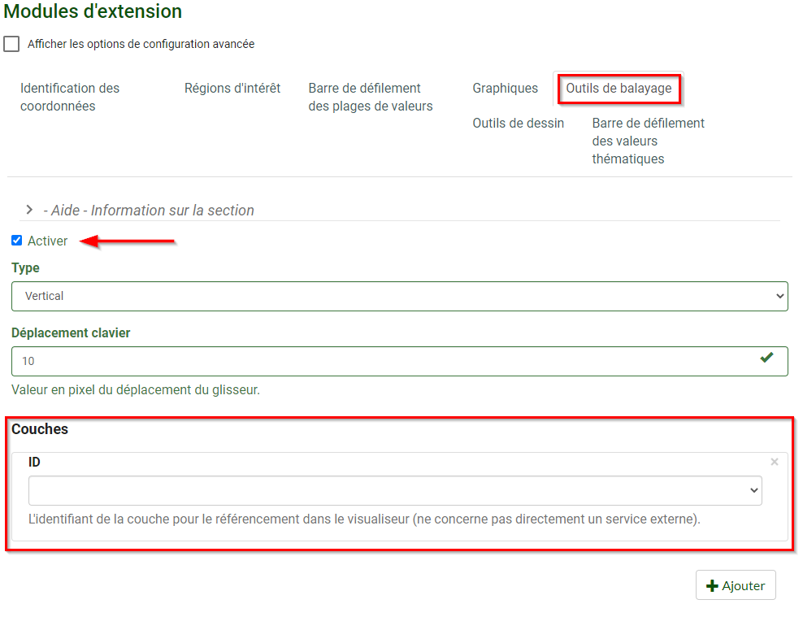

# Swiper
## What is the Swiper Plugin?

The Swiper plugin provides an intuitive interface to easily compare the content between layers.  As shown in Figure 45, the user can slide the swiping bar horizontally to closely examine the differences between two layers, which could be due to temporal change.  Swiper can also be used to reveal the content of one layer in relation to another.

## When to use it?

<figure>
  <iframe id="iframe1" allowfullscreen=true importance = high data-src="https://jolevesq.github.io/contributed-plugins/swiper/samples/swiper-index.html?sample=3"></iframe>
  <figcaption>Figure 45: Map Showing Land Cover of Canada (2010 & 2015)</figcaption>
</figure>

If you have two maps that represent the same theme using the same methods of mapping but for different timestamps, you may use the Swiper plugin to enhance the user experience in exploring any changes over time and space. For example, to visualize before-and-after imagery of a flood or display two related thematic layers in a map, the Swiper plugin gives the user the capability to move the slider back and forth to see the changes.

It is important to note that in this use case example (Figure 45) the two land cover layers are very similar. However, there are subtle difference which can be easily identified while using the Swiper plugin.

!!! Tip
    To identify the active layer of the Swiper plugin, simply place the mouse cursor over the vertical bar.

**Tip for interacting with the Swiper plugin:**
 	When using the tool to swipe, the enabled layer will be temporarily erased relative to the position of the swiper bar. It is recommended that the layer with the Swiper plugin enabled should be the topmost layer in the legend tree.

### How to use it – A use case

In this use case (Figure 46), the Swiper plugin was used to highlight the Hydro and Petroleum power plants rather than to detect changes. Having the Swiper plugin enabled on the 100MW and 1MW Hydropower plants while moving the swiping bar, the use can see clearly locations of different power plants for   areas of interest. More information on the data source can be found from the metadata.

<figure>
  <iframe id="iframe1" allowfullscreen=true importance = high data-src="https://jolevesq.github.io/contributed-plugins/swiper/samples/swiper-index.html?sample=1"></iframe>
  <figcaption>Figure 46: Map Showing Hydro and Petroleum Power Plants</figcaption>
</figure>

#### Configuring the Swiper plugin

Before you begin, Ensure that all Layers to be used should be configured in Authoring tool under the <emp>Map Tab</emp>. [(See Section: Using the Authoring Tool to Configure a Plugin – Adding a new layer)](/authortool/#adding-a-new-layer)

**<u>Step 1. Enable Swiper</u>**

Navigate to the <emp>Plugins</emp> section in the FGP Authoring Tool.

Under the <emp>Swiper tab</emp>, click on <emp>Enable</emp>.

By default. The <emp>“Type”</emp> will be set vertical. At the present time, this is the only option available. The <emp>“keyboard movement”</emp> is set to 10 by default. This is the recommended value; however, you may change it according to your use case.

<figure>
  
  <figcaption>Figure 47: Swiper plugin – Enable</figcaption>
</figure>

**<u>Step 2. Add Layers</u>**

Under the <emp>Layer Id</emp> (Figure 47), ensure that the layer to be used with the Swiper plugin is selected. In this use case, the <emp>Layer Id</emp> is automatically generated after adding layers in the Authoring Tool. Selecting the <emp>“2015 Land Cover”</emp> Layer will result in the Swiper being enabled on that layer.

!!! Note 
    The layer selected here will be the layer the Swiper plugin is enabled on.

### Definition of Parameters

Listed in the following table are the definitions of all the parameters available when using the FGP Authoring tool to configure the plugin to work with an applicable map service.

<table>
  <tr>
    <th></th>
    <th>Parameters</th>
    <th>Description</th>
  </tr>
 <tr>
    <th rowspan="2">General</th>
    <td id=parameters>Type</td>
    <td>Determines oi the swiper is vertical or horizontal. Note: Only vertical is supported at the moment</td>
  <tr>
    <td id=parameters>Keyboard Offset</td>
    <td>Determines the number of pixels to move the swiper when the keyboard is used for navigation</td>
  </tr>
  <tr>
    <th rowspan="1">Layers</th>
    <td id=parameters>Id</td>
    <td>Layer id as defined in the layer section</td>
  </tr>
</table>
