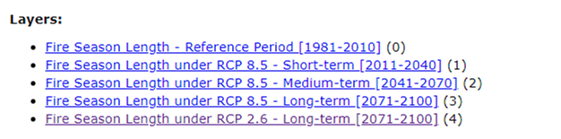
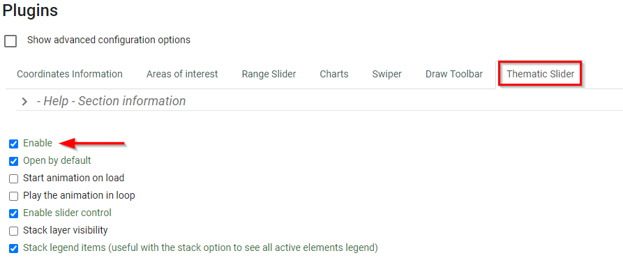
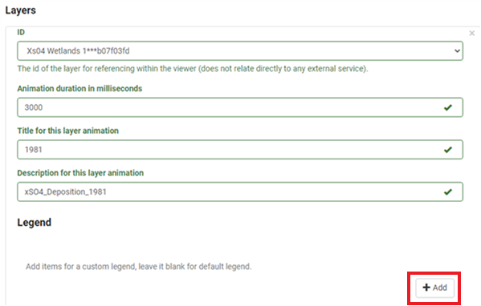

# Thematic Slider
## What is the Thematic Slider?

The Thematic Slider plugin enables you to create a time series animation using time series maps that are either prepared as multiple map services or as multiple layers within a map service. These maps represent a single theme with each map corresponding to a successive time stamp.   The resulting animation allows the end-users to quickly visualize changes of the theme of interest over time and across space.  

### Advantages of the Thematic Slider

- The ability to list all the layers to be displayed in order one after the other.
- The convenience to automatically cycle through / animate the layers when the map is loaded.
- If there is an extra context that can further explain/enhance the user experience or provide more information about the layer, the plugin allows for it to be placed.

## When to use it?

The Thematic Slider plugin is best used in cases where multiple layers represent the states of successive timestamps.  It provides the user with the ability to visualize the change occurring over each time as it cycles through each map. If contextual information is available for each layer, the Thematic Slider is a good choice as it allows you to place the text underneath the legend, which can be retrieved as you navigate through each layer.  

For the map service of Fire Season Length, for example, Figure 27 shows three map layers representing Short Term (2011-2040), Medium Term (2041-2070) and Long Term (2071-2100) under the climate change scenario of RCP 8.5. Using the Thematic Slider (Figure 26), these layers can be easily configured for time animation as well as for individual layer navigation via the play bar found at the bottom of the legend panel. Any textual information can be placed in the space below the legend.

<figure>
   <iframe id="iframe1" allowfullscreen=true importance = high data-src="https://jolevesq.github.io/contributed-plugins/thematic-slider/samples/thematic-slider-index.html?sample=9"></iframe>
  <figcaption>Figure 26: Map Showing Fire Season Length under RCP 8.5 across Canada</figcaption>
</figure>

<figure>
  
  <figcaption>Figure 27: Layers from Fire Season Map Service</figcaption>
</figure>

## How to use it – A use case

Using the xSO4D Wet Deposition maps 1981-2015 as a use case, below we demonstrate how to configure the Thematic Slider (Figure 28).

<figure>
   <iframe id="iframe1" allowfullscreen=true importance = high data-src="https://jolevesq.github.io/contributed-plugins/thematic-slider/samples/thematic-slider-index.html?sample=8"></iframe>
  <figcaption>Figure 28: Map Showing xSO4D Wet Disposition Maps (1981-2015)</figcaption>
</figure>

<figure>
  
  <figcaption>Figure 29: Layers listed for xSO4D Map Service</figcaption>
</figure>

### Preparing the data

To get started we need to ensure that the data is prepared in a format that will work well with the Thematic Slider plugin. In particular, you may ask:

- Are the multiple layers present in the map service each representing an individual time stamp? In our use case, the answer is yes as shown in Figure 29.

- Is it appropriate to use all the layers in the map service to configure the animation through the Thematic Slider? In principle, more layers tend to enhance the effect of animation; the time required to load the layers, however, is a constraint, which needs to be taken into consideration when preparing your data. In our current case, 36 layers could cause slow data upload. You may use all of them for testing, and opt to select layers periodiodically, e.g. every 5 or 10 years for including in animation.  

- Is the thematic layer served by this map service properly represented with respect to the color scheme, symbology, legend and projection? In the current case, the xSo4D maps show appropriate designs for all the cartographic elements.

Tip:
It is recommended to use the thematic slider with no more than 15 layers at a time. Testing has shown that a maximum of 15 layers meets the optimal loading time (3-5s) as recommended by the FGP Data team.

### Configuring the Thematic Slider

Before you begin, Ensure that all Layers to be used should be configured in Authoring tool under the <emp>Map Tab</emp>. [(See Section: Using the Authoring Tool to Configure a Plugin – Adding a new layer)](/authortool/#adding-a-new-layer)

**<u>Step 1. Enable Thematic Slider</u>**

Navigate to the <emp>Plugins</emp> section in the FGP Authoring Tool.

Under the <emp>Thematic Slider tab</emp>, click on <emp>Enable</emp>.

<figure>
  
  <figcaption>Figure 30: Thematic Slider - Configure Parameters</figcaption>
</figure>

**<u>Step 2. Select Options</u>**

Select from the following options to enable them depending on the intended use case (Figure 30).

1. Start animation on load
2. Play the animation on loop
3. Stack layer visibility

!!! Note 
    By default, the following will be enabled:

    1. Open by default
    2. Enable description control
    3. Enable Slider control

**<u>Step 3. Select Layers</u>**

Under <emp>Layers</emp>, select the layer on which the plugin will be enabled on. Set the <emp>Animation duration</emp>, <emp>Title for layer animation</emp>, and <emp>Description for layer animation</emp> (Figure 31).

<figure>
  
  <figcaption>Figure 31: Thematic Slider - Configure Layers</figcaption>
</figure>

At this point, you can add as many layers as required. In the use case example, a layer was selected every 5 years.

**<u>Step 4. Add custom legend</u>**

Optional, click on the <emp>Add</emp> Button to a custom legend for that layer (Figure 31).

### Definition of parameters

Listed in the following table are the definitions of all the parameters available when using the FGP Authoring tool to configure the Thematic Slider to work with an applicable map service.

<table>
  <tr>
    <th></th>
    <th>Parameters</th>
    <th>Description</th>
  </tr>
 <tr>
    <th rowspan="6">General</th>
    <td id=parameters>Open</td>
    <td>This plugin can be set to open automatically when a map loads. By default it is set open on map load</td>
  </tr>
  <tr>
    <td id=parameters>Auto run</td>
    <td>Determines if the plugin will start the animation automatically</td>
  </tr>
    <tr>
    <td id=parameters> Loop</td>
    <td>Determines if the plugin will restart the animation automatically when it reaches the end of the array</td>
  </tr>
    <tr>
    <td id=parameters>Description</td>
    <td>Determines if the description control is available</td>
  </tr>
    <tr>
    <td id=parameters>Slider</td>
    <td>Determines if the slider controls are available. Note: Description needs to be true for the slider to be enabled</td>
  </tr>
    <tr>
    <td id=parameters>Stack</td>
    <td>Determines if only the active layer is shown or if the visibility of all the layers is stacked. Layers are stacked from -Layer 0 to the active layer</td>
  </tr>
  <tr>
    <th rowspan="5">Layers</th>
    <td id=parameters>Id</td>
    <td>Determines the layer id as defined in the layer section.</td>
  </tr>
  <tr>
    <td id=parameters>Field</td>
    <td>layer id as define in the layer section</td>
  </tr>
    <tr>
    <td id=parameters>Duration</td>
    <td>duration in milliseconds to stay on the active layer</td>
  </tr>
    <tr>
    <td id=parameters>Title</td>
    <td>Title to show in description control</td>
  </tr>
    <tr>
    <td id=parameters>Description</td>
    <td>Text to show inside description control</td>
  </tr>
</table>
